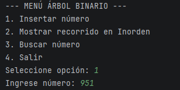
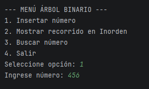
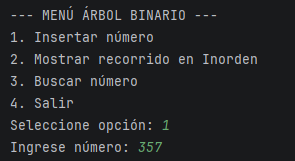
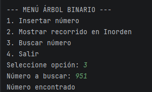
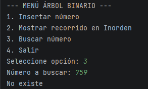
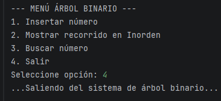
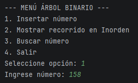
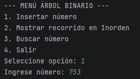
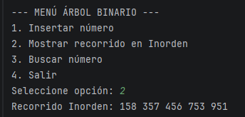

# Árbol Binario en Java

## Descripción
Este proyecto implementa un árbol binario en Java. El programa permite insertar números, mostrarlos mediante recorrido inorden y buscar valores usando un menú en consola.

## ¿Qué es un árbol binario?
Un árbol binario es una estructura de datos donde cada nodo puede tener máximo dos hijos: uno izquierdo y uno derecho. Se utiliza para organizar datos y facilitar su recorrido y búsqueda.

## Recorrido Inorden
El recorrido inorden sigue este orden: izquierda, raíz y derecha. Este recorrido permite mostrar los números ordenados de menor a mayor.

Ejemplo:
Si se ingresan los números:
158, 753, 951, 456, 357

El resultado del recorrido inorden es:

158 357 456 753 951

## Implementación
El proyecto está dividido en tres clases:
Nodo.java: representa cada nodo del árbol.
ArbolBinario.java: contiene los métodos para insertar, recorrer y buscar.
Main.java: contiene el menú para interactuar con el usuario.

## Ejemplo de ejecución
--- MENÚ ÁRBOL BINARIO ---
1. Insertar número
2. Mostrar recorrido Inorden
3. Buscar número
4. Salir

Seleccione opción: 1
Ingrese número: 158

Seleccione opción: 1
Ingrese número: 753

Seleccione opción: 1
Ingrese número: 951

Seleccione opción: 1
Ingrese número: 456

Seleccione opción: 1
Ingrese número: 357

Seleccione opción: 2
Recorrido Inorden: 158 357 456 753 951 

Seleccione opción: 3
Número a buscar: 951
Número encontrado

Seleccione opción: 3
Número a buscar: 759
No existe

Seleccione opción: 4
Saliendo del sistema de árbol binario...

## Evidencia

## Integrante
José Luis Alzate Quiroz

## Conclusión
Con este proyecto se logró comprender el funcionamiento de los árboles binarios y cómo implementar operaciones básicas como insertar, recorrer y buscar datos en Java.